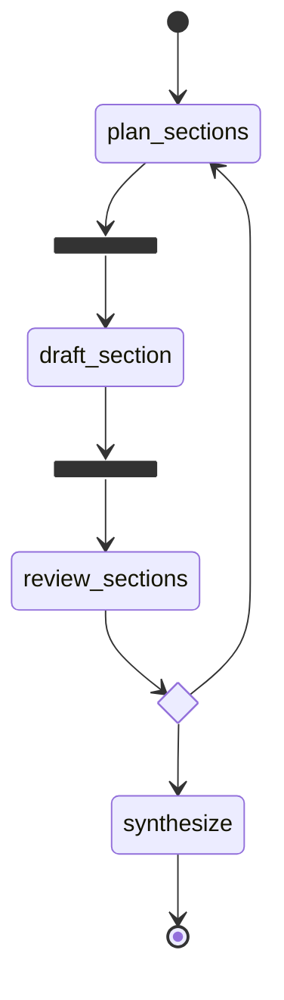

# MidwestBank AML Compliance Pipeline 
### 6 ADK (Agent Development Kit) Framework Comparison

Runs the same **Bank Secrecy Act (BSA) / Anti-Money Laundering (AML) compliance reporting pipeline** using six different agentic AI frameworks side by side, then displays a comparison of architecture, timing, and key differences.

## Business Case

**MidwestBank** 
The MidwestBank is a mid-size U.S. commercial bank headquartered in Kansas City, Missouri:

→ Total assets: $8 billion

→ Employees: 500 across 42 branches

→ Customers: 5,000+ active accounts

→ Primary regulators: FinCEN (BSA/AML), Office of the Comptroller of the Currency (OCC) for safety & soundness, and State Banking Department

## The Problem: Quarterly Report Generation

MidwestBank's 6-person compliance team faces a recurring crisis every quarter:

| Pain Point | Current Reality |
|------------|-----------------|
| **Manual data extraction** |	Pull data from 5 separate systems (core banking, AML platform, Know Your Customer (KYC) database, Suspicious Activity Report (SAR) system, risk engine) |
| **Report assembly time** |	4 full weeks per quarterly cycle for 3 different regulators |
| **Numerical errors** |	8-12 copy-paste errors per report (wrong totals, stale percentages) |
| **Terminology drift**	| Inconsistent use of regulatory terms across sections (e.g., mixing Customer Due Diligence "CDD" and "KYC" incorrectly) |
| **Cross-reference failures** | Section 2 may cite a number that contradicts Section 5 |
| **Regulatory risk**	| Q2 2024 error triggered a formal inquiry, costing 200+ hours of remediation |


## The Solution: AI-Powered Compliance Report Generator
We will build an Agentic AI system that:

→ Reads the regulator's template and dynamically plans which sections to generate

→ Dispatches 5 specialist workers for AML, KYC, SAR, Risk, and Remediation in parallel

→ Evaluates each section for numerical accuracy, terminology compliance, and cross-reference integrity

→ Iterates up to 3 times per section until quality passes all checks

→ Pauses for a compliance officer to review the final report before submission


## Results and Impact
The impact metrics below are benchmark-based estimates informed by consulting-firm research and comparable enterprise AI automation programs in financial services, compliance, and workflow transformation:

→ Reduced manual work by **35–45%** through automated data extraction and parallel agent orchestration.

→ Improved reporting accuracy by **50–70%** by validating numbers, terminology, and cross-references.

→ Increased operational efficiency by **40%** by shifting staff from manual assembly to exception review.

→ Shortened quarterly report turnaround by **25–35%**, accelerating regulator-ready delivery.

→ Lowered compliance risk by introducing structured review and iterative quality checks.


## The Architecture


## The Pipeline:

1. Analyze transaction data for suspicious activity and Currency Transaction Report (CTR) eligibility
2. Review SAR (Suspicious Activity Report) filing status
3. Assess KYC/CDD compliance (expired, pending, Politically Exposed Person (PEP) customers)
4. Detect AML patterns (structuring, layering, high-velocity)
5. Generate a structured regulatory compliance report


## ADK Frameworks

| # | Framework | Orchestration Model |
|---|-----------|--------------------|
| 1 | **LangGraph** | Graph (nodes + edges, Send fan-out) |
| 2 | **OpenAI Agent SDK** | Handoff-based (triage → specialists) |
| 3 | **CrewAI** | Role-based sequential pipeline |
| 4 | **AutoGen** | Group chat (RoundRobin) |
| 5 | **Google ADK** | Parallel + Sequential + Loop agents |
| 6 | **Pydantic AI** | Typed agents inside a pydantic-graph state machine |

### Why Pydantic AI is different

The other five runners pass **raw strings** between stages: a worker returns text, the
next stage parses or re-prompts on it. Pydantic AI makes every stage boundary a
**validated Pydantic model** — `SectionDraft`, `QualityReview`, `FinalReport`. A malformed
LLM response fails validation and is retried automatically, instead of flowing downstream
as plausible-looking garbage. For a compliance filing, that difference is the whole point.

Two more things it does that no other runner here does:

- **Dependency injection** — `ComplianceDeps` (carrying the live `RunMetrics`) is injected
  into every agent and every tool via `RunContext`, so tools record their own usage instead
  of mutating module globals.
- **The retry decision is a typed field.** The review loop branches on
  `QualityReview.approved: bool`, not on text parsed out of a model response.

The pipeline shape is declared up front with `pydantic-graph`, using its native `.map()`
fan-out and `join` fan-in rather than hand-rolled concurrency:



That diagram is not hand-drawn — it is generated from the graph itself:

```bash
python -c "from runners.pydantic_ai_runner import render_graph; print(render_graph())"
```

## Setup

**Python 3.11+ required.** Tested on Python 3.13.13.

```bash
# 1. Enter the project directory
cd Compare-ADKs-Project

# 2. Create virtual environment
python -m venv .venv
source .venv/bin/activate      # macOS/Linux
# .venv\Scripts\activate       # Windows

# 3. Install dependencies (two-phase — see note below)
bash install.sh

# 4. Configure API keys
cp .env.example .env
# Edit .env and add your OPENAI_API_KEY
```

> **Why two phases?** `crewai 1.14.6` pins `opentelemetry-api~=1.34.0` but
> `google-adk 2.2.0` requires `>=1.36`. These are mutually exclusive in a
> single `pip install` pass. `install.sh` installs google-adk first (setting
> opentelemetry to 1.41), then installs crewai with `--no-deps` to bypass the
> stale pin. CrewAI works fine at runtime with opentelemetry 1.41 — the pin
> just hasn't been updated upstream yet.

## Running

```bash
# Run all 6 frameworks sequentially
python main.py

# Run only one framework
python main.py --only langgraph
python main.py --only openai_agents
python main.py --only crewai
python main.py --only autogen
python main.py --only google_adk
python main.py --only pydantic_ai

# Skip a framework
python main.py --skip google_adk
```

## Testing

```bash
# Install dev dependencies
pip install -r requirements-dev.txt

# Full offline suite — no API key, no network calls
pytest -m "not live"

# With coverage
pytest -m "not live" --cov=shared --cov=comparison --cov=runners

# Live smoke test — hits the real OpenAI API, costs money, needs OPENAI_API_KEY
pytest -m live
```

| Layer | What it covers |
|-------|----------------|
| `tests/unit/` | `shared/` business logic (tools, data loader, metrics), comparison report wiring, Pydantic AI's typed models |
| `tests/integration/` | Every framework in `RUNNERS` exposes a valid `run(metrics)`; the Pydantic AI graph builds, renders, and caps its retry loop |
| `tests/smoke/test_smoke_offline.py` | The **entire** Pydantic AI pipeline end to end with zero network, via `pydantic_ai.models.test.TestModel` |
| `tests/smoke/test_smoke_live.py` | All 6 frameworks against the real API (opt-in, `-m live`) |

> **Note on coverage shape.** Pydantic AI ships `TestModel`/`FunctionModel`, so the sixth
> runner gets a genuine LLM-free end-to-end test. The other five frameworks have no
> comparable built-in test model, and bespoke HTTP mocks for CrewAI/AutoGen/Google-ADK
> internals would be fragile. So they are covered by offline contract tests plus the
> opt-in live smoke test rather than deep mocked unit tests.

## Expected Output

For each framework, the terminal shows:
```
============================================================
  Now running the pipeline using LangGraph
============================================================
[LangGraph] Report generated (420 words)
# MidwestBank — FinCEN BSA/AML Compliance Report Q4
...
```

At the end:
```
======================================================================
  ADK FRAMEWORKS COMPARISON — MIDWESTBANK COMPLIANCE PIPELINE
======================================================================
Framework              Status     Time(s)    LLM Calls    Report Words
----------------------------------------------------------------------
LangGraph              success    18.4       6            420
OpenAI Agent SDK       success    22.1       4            380
CrewAI                 success    25.6       3            445
AutoGen                success    19.8       5            390
Google ADK             success    21.3       7            410
Pydantic AI            success    49.9       19           642

ARCHITECTURAL COMPARISON
...
KEY DIFFERENCES SUMMARY
...
```

## Project Structure

```
compare-adks/
├── main.py                         # Entry point — run all 6 frameworks
├── shared/
│   ├── data_loader.py              # Load MidwestBank dataset
│   ├── tools.py                    # Shared tool functions
│   └── metrics.py                  # Timing + metrics tracking
├── runners/
│   ├── langgraph_runner.py         # LangGraph implementation
│   ├── openai_agents_runner.py     # OpenAI Agents SDK implementation
│   ├── crewai_runner.py            # CrewAI implementation
│   ├── autogen_runner.py           # AutoGen implementation
│   ├── google_adk_runner.py        # Google ADK implementation
│   └── pydantic_ai_runner.py       # Pydantic AI implementation
├── comparison/
│   └── report.py                   # Comparison report generator
├── tests/
│   ├── conftest.py                 # Shared fixtures + network guard
│   ├── unit/                       # shared/, comparison/, typed models
│   ├── integration/                # Runner contract + graph structure
│   └── smoke/                      # Offline (TestModel) + live end-to-end
├── data/                           # MidwestBank dataset (Lab 10)
│   ├── customers.csv
│   ├── transactions.csv
│   ├── sar_filings.csv
│   ├── prior_findings.csv
│   ├── regulatory_thresholds.json
│   ├── fincen_template.md
│   ├── occ_template.md
│   └── state_template.md
├── .github/workflows/ci.yml        # Lint + offline tests on 3.11 / 3.12
├── .env.example
├── requirements.txt
├── requirements-dev.txt
└── README.md
```

> `pydantic-ai/` may also be present locally — that is a reference clone of the
> upstream [pydantic/pydantic-ai](https://github.com/pydantic/pydantic-ai) library
> (its source, docs, and tests). It is **gitignored** and not part of this project;
> the runner installs `pydantic-ai-slim` from PyPI like any other dependency.

## Notes

- All frameworks use `gpt-4o-mini` by default (set `OPENAI_MODEL` in `.env` to override)
- Google ADK uses LiteLLM to route to OpenAI — no `GOOGLE_API_KEY` required
- LangGraph uses `MemorySaver` (in-memory) — no external storage needed
- AutoGen pre-fetches data into the agent context to avoid tool-call overhead
- Pydantic AI uses the `pydantic-ai-slim[openai]` package rather than the full
  `pydantic-ai` meta-package, which would pull in `logfire` and its own OpenTelemetry
  stack — colliding with the crewai/google-adk conflict `install.sh` already resolves
- Each runner is independent — no shared state between framework runs

## Platform

Linux / macOS / Windows supported. Python 3.11+.

## The Pipeline


<br><br>


<br><br>


## ADK Framework Comparison Results


<br><br>


## Observability


<br><br>


<br><br>


<br><br>


<br><br>


<br><br>


## Author

**Marcos Oliveira** — [LinkedIn](https://www.linkedin.com/in/mfilho1/) | [GitHub](https://github.com/MAOFILHO)
