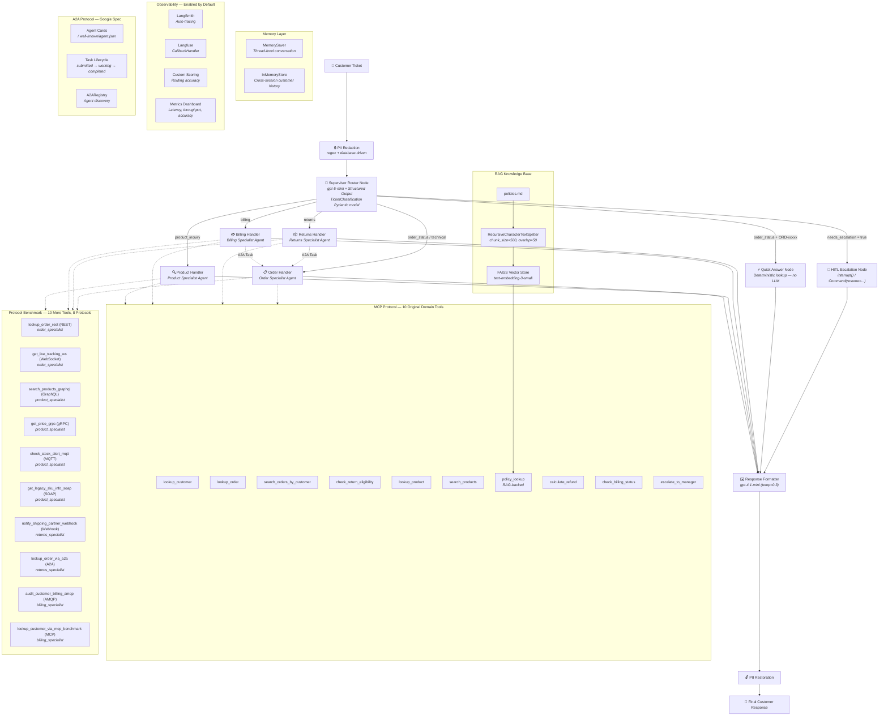
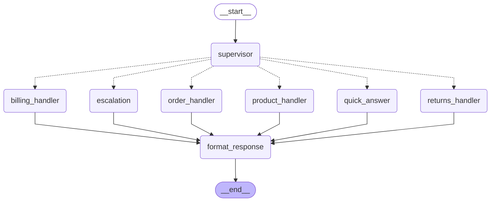

# Agentic AI - 10 Protocols Benchmark

A fork of the **ShopSmart Customer Support Multi-Agent System** that benchmarks **10 inter-service communication protocols** (REST, GraphQL, gRPC, Webhook, WebSocket, MQTT, AMQP, SOAP, MCP, A2A) side by side — using the *same* agent tool-calling loop, the *same* customer support domain, and the *same* observability stack (LangSmith + Langfuse), so results are directly comparable.

The differentiator vs. a synthetic protocol benchmark: each protocol does **real work** inside an actual ShopSmart specialist agent's tool-calling loop (e.g. GraphQL powers a product catalog search, AMQP powers a billing fraud/audit check, A2A powers a real agent-to-agent order lookup delegation) — not an isolated request/response microbenchmark. See [Protocol Comparison](#protocol-comparison) for real measured results, and [Benchmark Baselines](#benchmark-baselines) for how to reproduce them.

Everything below this point documents the underlying ShopSmart multi-agent system on which this benchmark is built.

## The Problem
ShopSmart is a mid-size e-commerce platform processing **50,000** customer support tickets per day. Their current system is a simple router that classifies tickets and sends them to human agents. This approach has several limitations:

| Current Pain Point  | Impact |
|---------------------|--------|
| Human agents handle ALL tickets |	High cost, slow response times |
| No automated order lookups | Agents spend 40% of their time just looking up order status |
| No policy consistency	| Different agents give different answers about return policies |
| Platinum customers wait in the queue | VIP customers get the same treatment as everyone else |
| No conversation memory | Customers repeat themselves when they call back |


## The Solution: Multi-Agent System
A production-grade multi-agent customer support system built with **LangChain**, **LangGraph**, and 10 protocols for Benchmark.


## Agentic Patterns Implemented

1. **Supervisor Router** — Structured output classification with business rule overrides
2. **Specialist Sub-Agents** — Domain-specific tool-calling agents via `create_agent`
3. **Deterministic Quick-Answer** — No LLM for simple order lookups (~30-40% of tickets)
4. **RAG Policy Lookup** — FAISS semantic search across policies.md
5. **PII Redaction** — Regex (email, phone) + database (names) before LLM exposure
6. **HITL Escalation** — LangGraph `interrupt()` + `Command(resume=...)` for human review
7. **Thread Memory** — `MemorySaver` for multi-turn conversation continuity
8. **Cross-Session Store** — `InMemoryStore` for customer history across threads
9. **10 Communication Protocols** — MCP-first architecture: tools defined in `mcp_server.py`, accessed via `mcp_client.py`. Google A2A spec (Agent Cards, Task lifecycle, Registry) — used for real handler-to-handler delegation. REST, GraphQL, gRPC (Phase 1), Webhook, WebSocket (Phase 2), MQTT, AMQP via Docker brokers (Phase 3), SOAP (Phase 4) — each wired into a real specialist agent's tool-calling loop and instrumented with the same shared fault-injection/timing seam (`fault_injector.py`, `protocol_timing.py`). All 10 protocols are directly comparable via `make benchmark` or the Streamlit "🔌 Protocol Benchmark" tab
10. **Dual Observability** — LangSmith auto-tracing + Langfuse callbacks


## Results & Impact
These estimates are grounded in real-world results from companies using AI support automation (e.g., Intercom, Zendesk AI, Klarna AI assistant, and IBM Watson Assistant case studies):

- **30–50%** ticket automation is typical once LLM + workflow routing is introduced.
- **25–60%** reduction in support costs via automation + deflection.
- **30–40%** of tickets are simple queries (order status, FAQs) → ideal for deterministic handling.
- **20–35%** improvement in first-response time with AI triage and prioritization.
- **15–25%** CSAT increase when memory + faster responses are introduced.
- **70%+** reduction in policy inconsistency when using centralized knowledge (RAG).


## Architecture

### Mermaid Diagram




## LangGraph Diagram



## Why This Architecture?
- Not every path needs AI: Simple order status queries use deterministic lookups (fast, cheap, reliable)
- Specialists outperform generalists: Each sub-agent has focused tools and prompts
- Humans stay in the loop: Critical decisions still go to human managers
- RAG ensures consistency: All agents reference the same policy knowledge base


### System Summary

| Component | Details |
|-----------|---------|
| **Graph Nodes** | 8 (supervisor + 5 handlers + escalation + formatter) |
| **Specialist Agents** | 4 (order, returns, billing, product) |
| **Tools** | 20 (defined in mcp_server.py, bridged via mcp_client.py — 10 original domain tools + 10 protocol-benchmark tools) |
| **Primary LLM** | gpt-5-mini (supervisor + specialists) |
| **Secondary LLM** | gpt-4.1-mini (response formatter, temp=0.3) |
| **RAG** | FAISS + text-embedding-3-small (policies.md, top-3) |
| **Memory** | MemorySaver (thread) + InMemoryStore (cross-session) |
| **Protocols Benchmarked** | 10 — REST, GraphQL, gRPC, Webhook, WebSocket, MQTT, AMQP, SOAP, MCP, A2A |
| **Observability** | LangSmith (auto-trace) + Langfuse (callback) |
| **Frontend** | Streamlit (chat, manager review, dashboard, Protocol Benchmark tab, observability) |


### Data

| Dataset | Records | Purpose |
|---------|---------|---------|
| customers.json | 10 | Customer profiles (tier, join date, ticket history) |
| orders.json | 100 | Order catalog (status, items, tracking, delivery) |
| products.json | 20 | Product specs, pricing, stock, FAQ |
| tickets.json | 100 | Support tickets (6 categories, 4 priority levels) |
| policies.md | ~3KB | Return, shipping, billing, escalation policies (RAG source) |

### Routing Logic

```
if needs_escalation → escalation (HITL)
elif order_status + has_order_id → quick_answer (no LLM)
elif order_status (no ID) → order_handler
elif returns → returns_handler
elif billing → billing_handler
elif product_inquiry → product_handler
elif technical → order_handler
elif escalation → escalation (HITL)
else → order_handler (fallback)
```

### Escalation Triggers

- Platinum customer + high/critical priority
- Classification confidence < 0.6
- Category classified as "escalation"
- Customer explicitly requests the manager
- Legal threats or social media threats
- High-value disputes > $500


## MCP-First Tool Architecture

MCP (Model Context Protocol) is the **standard** for tool access in this project, not an add-on:

```
  mcp_server.py           mcp_client.py            agents.py
┌───────────-───┐      ┌────-─────────--─┐      ┌──────────────┐
│  FastMCP      │      │  LangChain      │      │  Specialist  │
│  10 @mcp.tool │◄─────│  StructuredTool │◄─────│  Agents      │
│  definitions  │      │  wrappers       │      │  (4 agents)  │
└──────┬─────-──┘      └──────────────---┘      └──────────────┘
       │
       ▼ (make mcp)
  External MCP Clients
  (Claude Desktop, Cursor, etc.)
```

- **`mcp_server.py`** — Single source of truth. All 10 tools are defined here with `@mcp.tool()`.
- **`mcp_client.py`** — Bridges MCP tools to LangChain `StructuredTool` objects for agent consumption.
- **`make mcp`** — Starts the MCP server standalone for external clients (stdio transport).


## Prerequisites

- **Python 3.12** (tested on 3.12.10; setup script enforces 3.12)
- **OpenAI API key** (required for LLM and embeddings)
- **LangSmith API key** (optional — enables auto-tracing; the system runs fine without it, see Troubleshooting)
- **Langfuse API keys** (optional — enables callback tracing; the system runs fine without it, see Troubleshooting)
- **Docker Desktop** (only needed for the protocol benchmark's MQTT/AMQP brokers — Mosquitto + RabbitMQ, via `docker-compose.yml`; not required for the core ShopSmart chat/graph functionality)
- **Local ports 8001-8006** free (REST, GraphQL, gRPC, Webhook, WebSocket, SOAP protocol servers started by `make protocols-up`), plus **1883** (MQTT) and **5672**/**15672** (AMQP/RabbitMQ management) if running the full protocol benchmark


<br><br>


<br><br>


<br><br>


## Quick Start

```bash
# 1. Automated setup
make setup

# 2. Configure API keys
#    Edit .env with your OPENAI_API_KEY (required)
#    Optionally add LANGSMITH_API_KEY, LANGFUSE keys

# 3. Run smoke tests (offline — no API key needed)
make smoke

# 4. Run full test suite (requires OPENAI_API_KEY)
make test

# 5. Process a ticket via CLI
make run

# 6. Start the MCP server
make mcp

# 7. Launch the Streamlit app
make app

# 8. Generate the graph diagram (standalone)
make diagram
# Auto-generated on every make run / make app as well
# Output: docs/graph_diagram.md (Mermaid) + docs/graph_diagram.png (image)

# 9. Start the protocol servers (REST/GraphQL/gRPC/Webhook/WebSocket/SOAP)
make protocols-up

# 10. Start the MQTT/AMQP brokers (Docker) + responders
make brokers-up
make responders-up

# 11. Run the 10-protocol benchmark (terminal summary + output/protocol_benchmark_report.json + output/protocol_comparison.png)
make benchmark
# Or use the "🔌 Protocol Benchmark" tab in the Streamlit app (make app) for the same
# run with live charts in the browser

# 12. Tear down the protocol infrastructure when done
make protocols-down
make responders-down
make brokers-down
```


<br><br>


<br><br>


<br><br>


<br><br>


<br><br>


<br><br>


<br><br>


## Cleanup & Reinstall

To clean up build artifacts or do a full reinstall from scratch:

```bash
# Stop Streamlit first (Ctrl+C in the Streamlit terminal)

# Option 1: Clean caches only (keeps .venv)
make clean

# Option 2: Full cleanup (removes .venv for fresh reinstall)
make cleanup
```


After `make cleanup`, reinstall with:

```bash
make setup          # creates .venv and installs dependencies
# edit .env with your API keys (your .env file is preserved)
make smoke          # offline smoke tests
make test           # full test suite (requires OPENAI_API_KEY)
make run            # process a sample ticket via CLI
make app            # launch Streamlit frontend
```


## Project Structure

```
LangGraph-ShopSmart-10-Protocols-Benchmark/
├── src/shopsmart/              # Core package (the only thing that's `pip install -e`'d)
│   ├── config.py               # LLM/embeddings config + get_data_dir()/get_output_dir()
│   ├── state.py                # State schema + Pydantic models
│   ├── data_loader.py          # JSON dataset loader + select_benchmark_tickets()
│   ├── pii.py                  # PII redaction/restoration
│   ├── rag.py                  # FAISS RAG from policies.md
│   ├── mcp_server.py           # FastMCP server — canonical tool definitions (20 tools)
│   ├── mcp_client.py           # MCP-to-LangChain bridge (agents consume tools via MCP)
│   ├── agents.py               # 4 specialist agent builders
│   ├── nodes.py                # All graph node functions
│   ├── a2a.py                  # Google A2A protocol (full spec)
│   ├── graph.py                # StateGraph assembly + diagram generation + CLI
│   ├── observability.py        # LangSmith + Langfuse setup
│   ├── metrics.py              # System + protocol-benchmark metrics tracking
│   ├── charts.py                # Visualization (all output/ artifacts)
│   ├── fault_injector.py        # Per-protocol fault injection (timeout/error/malformed/refused)
│   ├── protocol_timing.py       # @timed_protocol_call — shared instrumentation seam
│   └── protocols/                # REST/GraphQL/gRPC/Webhook/WS/MQTT/AMQP/SOAP/MCP/A2A clients+servers
├── apps/                        # Entry-point scripts (consumers of the package, not part of it)
│   ├── streamlit_app.py         # Streamlit web application (chat, HITL, dashboards, benchmark tab)
│   └── benchmark_runner.py      # CLI harness for the 10-protocol benchmark
├── data/                        # Datasets (customers, orders, products, tickets, policies)
├── tests/                       # Test suite (smoke, tools, PII, RAG, routing, HITL, memory, MCP,
│                                 #   test_protocols/ for the 10 protocol integrations)
├── scripts/                     # setup.sh, smoke_test.sh — one-time/dev tooling, not app code
├── docs/                        # Architecture diagram, auto-generated graph, metrics reference
├── docker/                      # Broker configs (mosquitto.conf)
├── output/                      # Generated reports/charts (gitignored, recreated by `make clean`)
├── docker-compose.yml           # Mosquitto + RabbitMQ, for local MQTT/AMQP brokers
├── Makefile                     # Build/run commands
└── pyproject.toml               # Packaging metadata + dependencies
```

**Why this layout:** `src/shopsmart/` is the installable package — nothing outside it should ever be imported *by* it, which is what the src-layout convention guarantees (it's why `apps/streamlit_app.py` and `apps/benchmark_runner.py` sit outside `src/`, alongside `pyproject.toml` and `docker-compose.yml`: they're consumers of the package, not part of it).

## Models

| Model | Role | Temperature |
|-------|------|-------------|
| gpt-5-mini | Primary (supervisor + specialists) | default |
| gpt-4.1-mini | Secondary (response formatter) | 0.3 |
| text-embedding-3-small | RAG embeddings | — |


## Environment Variables

### Core

| Variable | Required | Description |
|----------|----------|-------------|
| `OPENAI_API_KEY` | Yes | OpenAI API key |
| `LANGSMITH_API_KEY` | No | LangSmith auto-tracing (system runs fine without it) |
| `LANGSMITH_PROJECT` | No | LangSmith project name (default: shopsmart-support) |
| `LANGFUSE_PUBLIC_KEY` | No | Langfuse callback tracing (system runs fine without it) |
| `LANGFUSE_SECRET_KEY` | No | Langfuse secret |
| `LANGFUSE_HOST` | No | Langfuse host (default: https://us.cloud.langfuse.com) |

### Protocol Benchmark 
(all optional — defaults in `.env.example` work out of the box with `make protocols-up`/`brokers-up`)

| Variable | Description |
|----------|-------------|
| `REST_BASE_URL`, `GRAPHQL_URL`, `GRPC_PRICING_ADDR` | Phase 1 protocol server addresses |
| `WEBHOOK_URL`, `WS_TRACKING_URL` | Phase 2 protocol server addresses |
| `MQTT_BROKER_HOST`/`PORT`, `AMQP_URL` | Phase 3 broker addresses (Docker: Mosquitto, RabbitMQ) |
| `SOAP_URL` | Phase 4 protocol server address |
| `FAULT_MODE_<PROTOCOL>` | Per-protocol fault injection: `none` \| `timeout` \| `error` \| `malformed` \| `refused` (e.g. `FAULT_MODE_MQTT=timeout`) |
| `<PROTOCOL>_TIMEOUT_S` | Per-protocol client timeout in seconds |
| `<PROTOCOL>_MAX_RETRIES` | Per-protocol max retry attempts on failure |


### Benchmark Baselines

Based on initial testing with a 10-ticket batch:

| Metric | Baseline |
|--------|----------|
| Routing Accuracy | ~85-95% |
| Avg Latency (quick_answer) | < 0.5s |
| Avg Latency (specialist) | 2-4s |
| Avg Latency (HITL) | Depends on human response time |
| Escalation Rate | ~10-15% (with platinum customer in dataset) |
| Quick Answer Rate | ~35% (order_status with order ID) |

### Protocol Comparison
Example run (10 tickets, category-balanced selection)

Produced via `make benchmark` (or the Streamlit "🔌 Protocol Benchmark" tab), using `select_benchmark_tickets()` to guarantee all 10 ticket categories are represented:

| Protocol | Calls | p50 (ms) | p95 (ms) | Avg Payload (B) | Error % | Retry % |
|----------|------:|---------:|---------:|-----------------:|--------:|--------:|
| A2A      | 2 | 19,459.20 | 23,367.30 | 943 | 0 | 0 |
| MQTT     | 2 | 1,013.49  | 1,017.84  | 59  | 0 | 0 |
| REST     | 3 | 36.38     | 48.99     | 370.7 | 0 | 0 |
| GRAPHQL  | 5 | 35.89     | 53.41     | 130.8 | 0 | 0 |
| WEBHOOK  | 2 | 35.20     | 42.95     | 76  | 0 | 0 |
| SOAP     | 1 | 39.83     | 39.83     | 102 | 0 | 0 |
| AMQP     | 2 | 55.05     | 58.33     | 67  | 0 | 0 |
| WS       | 3 | 6.11      | 18.69     | 146.7 | 0 | 0 |
| GRPC     | 2 | 10.33     | 23.38     | 94.5 | 0 | 0 |
| MCP      | 2 | 2.45      | 6.99      | 98.5 | 0 | 0 |

**Key takeaway — A2A is ~3 orders of magnitude slower than every other protocol**, and that's expected, not a defect: in this project's A2A implementation, `A2AServer.send_task()` synchronously invokes the target specialist's *full* `agent.invoke()` tool-calling loop — a real nested LLM round-trip — while every other protocol here is a lightweight RPC/pub-sub call against a local server or broker. A2A's "payload" is effectively another agent's reasoning process, not a wire message. MQTT is the next-slowest (~1s), reflecting the real cost of its publish/subscribe-with-correlation-id round trip over the broker, versus the sub-100ms direct-call protocols (REST/GraphQL/gRPC/SOAP/Webhook/WS/MCP).

**A2A's latency variance is dominated by nested-LLM-call risk, not the A2A transport itself.** A follow-up 15-ticket run produced `A2A p50 = 19,459 ms` but `A2A p95 = 1,304,067 ms` (~21.7 minutes) on the exact same protocol — a ~65x spread within one protocol's own results. The cause: one A2A call's nested `order_specialist.invoke()` happened to hit an OpenAI rate-limit retry storm, and since `timed_protocol_call` measures wall-clock time around the *entire* A2A call (including whatever the delegated agent does internally), that retry delay is fully absorbed into the A2A latency figure — while `error_rate`/`retry_rate` stayed at 0% (those track transport-level retries in `protocol_timing.py`, not the OpenAI SDK's own internal backoff, which happens one layer deeper inside the nested call). In other words: A2A is the one protocol here whose measured latency is only as predictable as the LLM call graph behind it, which is itself a notable finding about delegating work via A2A vs. a direct RPC/pub-sub protocol.


## 🔌 Web App - Protocol Benchmark tab


<br><br>


<br><br>


<br><br>


<br><br>


### CLI Commands

```bash
make metrics    # Print system summary to stdout
make test       # Run full test suite (includes routing accuracy)
make smoke      # Quick validation (no API key required for offline tests)
```


## Troubleshooting

### Tests skipped with "OPENAI_API_KEY not set"

The `.env` file is not being loaded by pytest. Verify that your `.env` file exists in the project root (not `.env.example`) and contains `OPENAI_API_KEY=sk-...`. The test suite loads it automatically via `python-dotenv` in `tests/conftest.py`.

```bash
# Verify .env exists and has the key
cat .env | grep OPENAI_API_KEY
```

### OpenAI 429 "insufficient_quota" errors

Your OpenAI API key has no credits or billing is not enabled. Go to [platform.openai.com/settings/organization/billing](https://platform.openai.com/settings/organization/billing) and add a payment method or purchase credits. The full test suite costs under $0.50.


### ImportError: `create_tool_calling_agent` or `create_react_agent`

The LangChain agent API has changed across versions:
- `create_tool_calling_agent` was removed in `langchain` v1.3.10
- `create_react_agent` from `langgraph.prebuilt` is deprecated in favour of `langchain.agents.create_agent`

This project uses `create_agent` from `langchain.agents` with the `system_prompt=` parameter (not the older `prompt=` parameter). If you see `TypeError: create_agent() got an unexpected keyword argument 'prompt'`, change `prompt=` to `system_prompt=` in your agent builder calls.

The pinned versions in `pyproject.toml` are tested to be compatible:

```
langchain>=0.3
langchain-openai>=0.3
langgraph>=0.3
langchain-community>=0.3
```

### LangSmith 403 "Forbidden" warnings

Your `LANGSMITH_API_KEY` is invalid, expired, or associated with a different organization. Either:
- Update the key at [smith.langchain.com](https://smith.langchain.com/) → Settings → API Keys
- Or remove/comment out `LANGSMITH_API_KEY` from `.env` to disable LangSmith tracing (the system runs fine without it)

### Langfuse connection errors

Verify that both `LANGFUSE_PUBLIC_KEY` and `LANGFUSE_SECRET_KEY` are set in `.env`. If using Langfuse Cloud, ensure `LANGFUSE_HOST` is set to `https://us.cloud.langfuse.com` (US) or `https://cloud.langfuse.com` (EU), matching your account region.

### `langchain-community` deprecation warning

You may see: `DeprecationWarning: langchain-community is being sunset`. This is a known upstream warning — the FAISS integration still works. A future update will migrate to a standalone `langchain-faiss` package when available.

### `ModuleNotFoundError: No module named 'langchain_text_splitters'`

Run `pip install -e ".[dev]"` again — this dependency is installed transitively via `langchain`. If it persists, install directly: `pip install langchain-text-splitters`.

### macOS: Streamlit Watchdog performance warning

On macOS, Streamlit recommends the Watchdog module for better file-watching performance. This is included in the project dependencies, but requires Xcode command-line tools:

```bash
xcode-select --install   # one-time macOS setup
pip install -e ".[dev]"  # watchdog is included in dependencies
```

### Streamlit: `ImportError: cannot import name 'X' from 'shopsmart...'` after pulling/editing code

Streamlit's autoreload only re-executes `streamlit_app.py` itself on save — it does **not** reliably re-import already-loaded modules in `src/shopsmart/` within a long-running server process (this bit us when adding `select_benchmark_tickets` to `data_loader.py` while the app was already running from a prior manual test session). If you add or rename a function/module and the running app can't find it, fully restart the server rather than relying on the browser's auto-rerun:

```bash
# In the terminal running `make app`:
Ctrl+C
make app
```

### Protocol Benchmark tab: some protocols always show 0 calls

This can be a real finding, not a bug: category-to-protocol coverage isn't 1:1 (see `select_benchmark_tickets()` in `data_loader.py`, which round-robins tickets across categories precisely to make this less likely). Even with every category represented, a given protocol only fires if the LLM actually chooses that tool during its tool-calling loop for that ticket. Also note **order_status tickets with a resolvable `ORD-xxxxx` id skip the agent entirely** via the deterministic quick-answer path (see "Routing Logic" above) — so REST/WebSocket (bound to `order_specialist`) won't fire for those, only for order tickets that fall through to the full agent. Increasing ticket count improves odds; 0 calls after a reasonably sized run (8-10+ tickets) is worth noting as a real signal about tool-selection/routing behaviour.

### Python version errors

This project requires **Python 3.12** (tested on 3.12.10). The setup script enforces this — if `python3.12` is not found, it will tell you how to install it:

```bash
brew install python@3.12     # Homebrew
pyenv install 3.12.10        # pyenv
```


If you see syntax errors related to `str | None` or `dict[str, list]`, your Python version is too old. Check with `python3.12 --version`.


## System Metrics Reference

### Operational Metrics

| Metric | Description | Target |
|--------|-------------|--------|
| **Routing Accuracy** | % of tickets correctly classified by supervisor | ≥ 80% |
| **Avg Latency** | Mean time from ticket submission to final response | < 5s |
| **Escalation Rate** | % of tickets requiring HITL human review | < 15% |
| **Quick Answer Rate** | % of tickets resolved via deterministic path (no LLM) | 30-40% |
| **Tool Usage** | Frequency of each tool invocation across tickets | — |
| **Category Distribution** | Breakdown of tickets by category | — |
| **Priority Distribution** | Breakdown of tickets by priority level | — |


### Observability Metrics (LangSmith + Langfuse)

| Metric | Platform | Description |
|--------|----------|-------------|
| **Trace Latency** | Both | Per-node execution time breakdown |
| **Token Usage** | Both | Input/output tokens per LLM call |
| **Cost per Ticket** | Both | $ cost per ticket (auto-computed from tokens) |
| **Custom Scores** | Both | Routing accuracy score per classification |
| **Error Rate** | Both | Failed LLM calls or tool errors |


<br><br>


<br><br>


<br><br>


<br><br>


<br><br>


<br><br>


<br><br>


<br><br>


<br><br>


## ShopSmart Web Application (screenshots)


<br><br>


<br><br>


<br><br>


<br><br>


<br><br>


<br><br>


## Author

**Marcos Oliveira** — [LinkedIn](https://www.linkedin.com/in/mfilho1/) | [GitHub](https://github.com/MAOFILHO)
