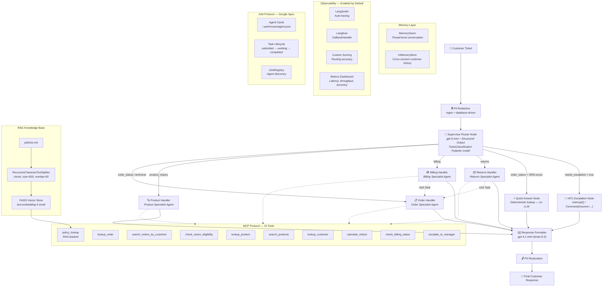

# ShopSmart Support — System Architecture

## Mermaid Diagram



## System Summary

| Component | Details |
|-----------|---------|
| **Graph Nodes** | 8 (supervisor + 5 handlers + escalation + formatter) |
| **Specialist Agents** | 4 (order, returns, billing, product) |
| **Tools** | 10 (MCP-first: defined in mcp_server.py, bridged via mcp_client.py) |
| **Primary LLM** | gpt-5-mini (supervisor + specialists) |
| **Secondary LLM** | gpt-4.1-mini (response formatter, temp=0.3) |
| **RAG** | FAISS + text-embedding-3-small (policies.md, top-3) |
| **Memory** | MemorySaver (thread) + InMemoryStore (cross-session) |
| **Protocols** | MCP (tool invocation) + A2A (inter-agent communication) |
| **Observability** | LangSmith (auto-trace) + Langfuse (callback) |
| **Frontend** | Streamlit (chat, manager review, dashboard, observability) |

## Patterns Implemented

1. **Supervisor Router** — Structured output classification with business rule overrides
2. **Specialist Sub-Agents** — Domain-specific tool-calling agents via `create_agent`
3. **Deterministic Quick-Answer** — No LLM for simple order lookups (~30-40% of tickets)
4. **RAG Policy Lookup** — FAISS semantic search across policies.md
5. **PII Redaction** — Regex (email, phone) + database (names) before LLM exposure
6. **HITL Escalation** — LangGraph `interrupt()` + `Command(resume=...)` for human review
7. **Thread Memory** — `MemorySaver` for multi-turn conversation continuity
8. **Cross-Session Store** — `InMemoryStore` for customer history across threads
9. **MCP Protocol** — MCP-first architecture: tools defined in `mcp_server.py`, accessed via `mcp_client.py`, also available standalone (`make mcp`)
10. **A2A Protocol** — Google A2A spec (Agent Cards, Task lifecycle, Registry)
11. **Dual Observability** — LangSmith auto-tracing + Langfuse callbacks

## Data

| Dataset | Records | Purpose |
|---------|---------|---------|
| customers.json | 10 | Customer profiles (tier, join date, ticket history) |
| orders.json | 100 | Order catalog (status, items, tracking, delivery) |
| products.json | 20 | Product specs, pricing, stock, FAQ |
| tickets.json | 100 | Support tickets (6 categories, 4 priority levels) |
| policies.md | ~3KB | Return, shipping, billing, escalation policies (RAG source) |

## Routing Logic

```
if needs_escalation → escalation (HITL)
elif order_status + has_order_id → quick_answer (no LLM)
elif order_status (no ID) → order_handler
elif returns → returns_handler
elif billing → billing_handler
elif product_inquiry → product_handler
elif technical → order_handler
elif escalation → escalation (HITL)
else → order_handler (fallback)
```

## Escalation Triggers

- Platinum customer + high/critical priority
- Classification confidence < 0.6
- Category classified as "escalation"
- Customer explicitly requests manager
- Legal threats or social media threats
- High-value disputes > $500
