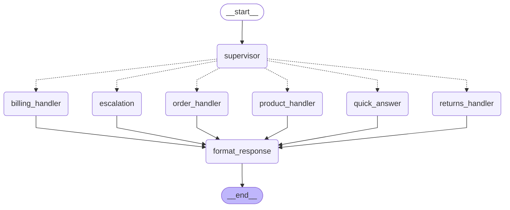

# ShopSmart Support — Auto-Generated Graph Diagram

```mermaid
---
config:
  flowchart:
    curve: linear
---
graph TD;
	__start__([<p>__start__</p>]):::first
	supervisor(supervisor)
	quick_answer(quick_answer)
	order_handler(order_handler)
	returns_handler(returns_handler)
	billing_handler(billing_handler)
	product_handler(product_handler)
	escalation(escalation)
	format_response(format_response)
	__end__([<p>__end__</p>]):::last
	__start__ --> supervisor;
	billing_handler --> format_response;
	escalation --> format_response;
	order_handler --> format_response;
	product_handler --> format_response;
	quick_answer --> format_response;
	returns_handler --> format_response;
	supervisor -.-> billing_handler;
	supervisor -.-> escalation;
	supervisor -.-> order_handler;
	supervisor -.-> product_handler;
	supervisor -.-> quick_answer;
	supervisor -.-> returns_handler;
	format_response --> __end__;
	classDef default fill:#f2f0ff,line-height:1.2
	classDef first fill-opacity:0
	classDef last fill:#bfb6fc

```
