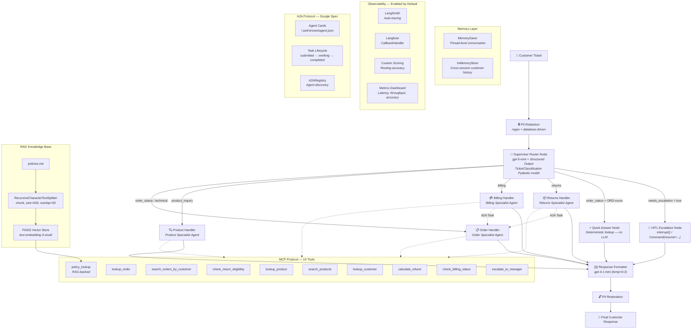
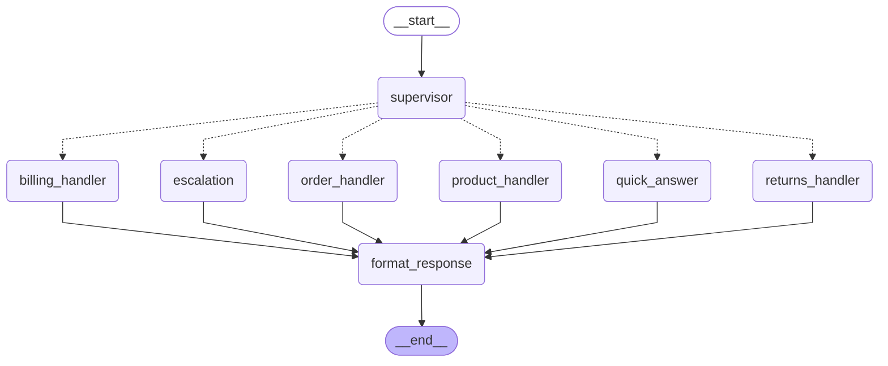

# ShopSmart Customer Support — Multi-Agent System

A production-grade multi-agent customer support system built with **LangChain**, **LangGraph**, **MCP**, and **A2A** protocols.

## Prerequisites

- **Python 3.12** (tested on 3.12.10; setup script enforces 3.12)
- **OpenAI API key** (required for LLM and embeddings)
- **LangSmith API key** (required — observability)
- **Langfuse API keys** (required — observability)


## Architecture

## Mermaid Diagram



## System Summary

| Component | Details |
|-----------|---------|
| **Graph Nodes** | 8 (supervisor + 5 handlers + escalation + formatter) |
| **Specialist Agents** | 4 (order, returns, billing, product) |
| **Tools** | 10 (MCP-first: defined in mcp_server.py, bridged via mcp_client.py) |
| **Primary LLM** | gpt-5-mini (supervisor + specialists) |
| **Secondary LLM** | gpt-4.1-mini (response formatter, temp=0.3) |
| **RAG** | FAISS + text-embedding-3-small (policies.md, top-3) |
| **Memory** | MemorySaver (thread) + InMemoryStore (cross-session) |
| **Protocols** | MCP (tool invocation) + A2A (inter-agent communication) |
| **Observability** | LangSmith (auto-trace) + Langfuse (callback) |
| **Frontend** | Streamlit (chat, manager review, dashboard, observability) |

## Patterns Implemented

1. **Supervisor Router** — Structured output classification with business rule overrides
2. **Specialist Sub-Agents** — Domain-specific tool-calling agents via `create_agent`
3. **Deterministic Quick-Answer** — No LLM for simple order lookups (~30-40% of tickets)
4. **RAG Policy Lookup** — FAISS semantic search across policies.md
5. **PII Redaction** — Regex (email, phone) + database (names) before LLM exposure
6. **HITL Escalation** — LangGraph `interrupt()` + `Command(resume=...)` for human review
7. **Thread Memory** — `MemorySaver` for multi-turn conversation continuity
8. **Cross-Session Store** — `InMemoryStore` for customer history across threads
9. **MCP Protocol** — MCP-first architecture: tools defined in `mcp_server.py`, accessed via `mcp_client.py`, also available standalone (`make mcp`)
10. **A2A Protocol** — Google A2A spec (Agent Cards, Task lifecycle, Registry)
11. **Dual Observability** — LangSmith auto-tracing + Langfuse callbacks

## Data

| Dataset | Records | Purpose |
|---------|---------|---------|
| customers.json | 10 | Customer profiles (tier, join date, ticket history) |
| orders.json | 100 | Order catalog (status, items, tracking, delivery) |
| products.json | 20 | Product specs, pricing, stock, FAQ |
| tickets.json | 100 | Support tickets (6 categories, 4 priority levels) |
| policies.md | ~3KB | Return, shipping, billing, escalation policies (RAG source) |

## Routing Logic

```
if needs_escalation → escalation (HITL)
elif order_status + has_order_id → quick_answer (no LLM)
elif order_status (no ID) → order_handler
elif returns → returns_handler
elif billing → billing_handler
elif product_inquiry → product_handler
elif technical → order_handler
elif escalation → escalation (HITL)
else → order_handler (fallback)
```

## Escalation Triggers

- Platinum customer + high/critical priority
- Classification confidence < 0.6
- Category classified as "escalation"
- Customer explicitly requests manager
- Legal threats or social media threats
- High-value disputes > $500


See [docs/architecture.md](docs/architecture.md) for the hand-crafted system diagram and [docs/graph_diagram.md](docs/graph_diagram.md) for the auto-generated LangGraph diagram.

---

## Auto-Generated Graph Diagram



----

### MCP-First Tool Architecture

MCP (Model Context Protocol) is the **standard** for tool access in this project, not an add-on:

```
mcp_server.py          mcp_client.py           agents.py
┌───────────-───┐      ┌────-─────────--─┐      ┌──────────────┐
│  FastMCP      │      │  LangChain      │      │  Specialist  │
│  10 @mcp.tool │◄─────│  StructuredTool │◄─────│  Agents      │
│  definitions  │      │  wrappers       │      │  (4 agents)  │
└──────┬─────-──┘      └──────────────---┘      └──────────────┘
       │
       ▼ (make mcp)
  External MCP Clients
  (Claude Desktop, Cursor, etc.)
```

- **`mcp_server.py`** — Single source of truth. All 10 tools are defined here with `@mcp.tool()`.
- **`mcp_client.py`** — Bridges MCP tools to LangChain `StructuredTool` objects for agent consumption.
- **`make mcp`** — Starts the MCP server standalone for external clients (stdio transport).

## Quick Start

```bash
# 1. Automated setup
make setup

# 2. Configure API keys
#    Edit .env with your OPENAI_API_KEY (required)
#    Optionally add LANGSMITH_API_KEY, LANGFUSE keys

# 3. Run smoke tests (offline — no API key needed)
make smoke

# 4. Run full test suite (requires OPENAI_API_KEY)
make test

# 5. Process a ticket via CLI
make run

# 6. Start the MCP server
make mcp

# 7. Launch the Streamlit app
make app

# 8. Generate the graph diagram (standalone)
make diagram
# Auto-generated on every make run / make app as well
# Output: docs/graph_diagram.md (Mermaid) + docs/graph_diagram.png (image)
```

## Cleanup & Reinstall

To clean up build artifacts or do a full reinstall from scratch:

```bash
# Stop Streamlit first (Ctrl+C in the Streamlit terminal)

# Option 1: Clean caches only (keeps .venv)
make clean

# Option 2: Full cleanup (removes .venv for fresh reinstall)
make cleanup
```

After `make cleanup`, reinstall with:

```bash
make setup          # creates .venv and installs dependencies
# edit .env with your API keys (your .env file is preserved)
make smoke          # offline smoke tests
make test           # full test suite (requires OPENAI_API_KEY)
make run            # process a sample ticket via CLI
make app            # launch Streamlit frontend
```

## Project Structure

```
shopsmart-support/
├── src/shopsmart/          # Core package
│   ├── config.py           # LLM + embeddings configuration
│   ├── state.py            # State schema + Pydantic models
│   ├── data_loader.py      # JSON dataset loader
│   ├── pii.py              # PII redaction/restoration
│   ├── rag.py              # FAISS RAG from policies.md
│   ├── mcp_server.py       # FastMCP server — canonical tool definitions (10 tools)
│   ├── mcp_client.py       # MCP-to-LangChain bridge (agents consume tools via MCP)
│   ├── agents.py           # 4 specialist agent builders
│   ├── nodes.py            # All graph node functions
│   ├── a2a.py              # Google A2A protocol (full spec)
│   ├── graph.py            # StateGraph assembly + diagram generation + CLI
│   ├── observability.py    # LangSmith + Langfuse setup
│   ├── metrics.py          # System metrics tracking
│   └── charts.py           # Visualization
├── data/                   # Datasets (customers, orders, products, tickets, policies)
├── tests/                  # Test suite (smoke, tools, PII, RAG, routing, HITL, memory, MCP)
├── scripts/                # setup.sh, smoke_test.sh
├── docs/                   # Architecture diagram, auto-generated graph, metrics reference
├── streamlit_app.py        # Streamlit web application
├── Makefile                # Build commands
└── pyproject.toml          # Dependencies
```

## Models

| Model | Role | Temperature |
|-------|------|-------------|
| gpt-5-mini | Primary (supervisor + specialists) | default |
| gpt-4.1-mini | Secondary (response formatter) | 0.3 |
| text-embedding-3-small | RAG embeddings | — |

## Environment Variables

| Variable | Required | Description |
|----------|----------|-------------|
| `OPENAI_API_KEY` | Yes | OpenAI API key |
| `LANGSMITH_API_KEY` | No | LangSmith auto-tracing |
| `LANGSMITH_PROJECT` | No | LangSmith project name (default: shopsmart-support) |
| `LANGFUSE_PUBLIC_KEY` | No | Langfuse callback tracing |
| `LANGFUSE_SECRET_KEY` | No | Langfuse secret |
| `LANGFUSE_HOST` | No | Langfuse host (default: https://us.cloud.langfuse.com) |

## Troubleshooting

### Tests skipped with "OPENAI_API_KEY not set"

The `.env` file is not being loaded by pytest. Verify that your `.env` file exists in the project root (not `.env.example`) and contains `OPENAI_API_KEY=sk-...`. The test suite loads it automatically via `python-dotenv` in `tests/conftest.py`.

```bash
# Verify .env exists and has the key
cat .env | grep OPENAI_API_KEY
```

### OpenAI 429 "insufficient_quota" errors

Your OpenAI API key has no credits or billing is not enabled. Go to [platform.openai.com/settings/organization/billing](https://platform.openai.com/settings/organization/billing) and add a payment method or purchase credits. The full test suite costs under $0.50.

### ImportError: `create_tool_calling_agent` or `create_react_agent`

The LangChain agent API has changed across versions:
- `create_tool_calling_agent` was removed in `langchain` v1.3.10
- `create_react_agent` from `langgraph.prebuilt` is deprecated in favor of `langchain.agents.create_agent`

This project uses `create_agent` from `langchain.agents` with the `system_prompt=` parameter (not the older `prompt=` parameter). If you see `TypeError: create_agent() got an unexpected keyword argument 'prompt'`, change `prompt=` to `system_prompt=` in your agent builder calls.

The pinned versions in `pyproject.toml` are tested compatible:

```
langchain>=0.3
langchain-openai>=0.3
langgraph>=0.3
langchain-community>=0.3
```

### LangSmith 403 "Forbidden" warnings

Your `LANGSMITH_API_KEY` is invalid, expired, or associated with a different organization. Either:
- Update the key at [smith.langchain.com](https://smith.langchain.com/) → Settings → API Keys
- Or remove/comment out `LANGSMITH_API_KEY` from `.env` to disable LangSmith tracing (the system runs fine without it)

### Langfuse connection errors

Verify that both `LANGFUSE_PUBLIC_KEY` and `LANGFUSE_SECRET_KEY` are set in `.env`. If using Langfuse Cloud, ensure `LANGFUSE_HOST` is set to `https://us.cloud.langfuse.com` (US) or `https://cloud.langfuse.com` (EU) matching your account region.

### `langchain-community` deprecation warning

You may see: `DeprecationWarning: langchain-community is being sunset`. This is a known upstream warning — the FAISS integration still works. A future update will migrate to a standalone `langchain-faiss` package when available.

### `ModuleNotFoundError: No module named 'langchain_text_splitters'`

Run `pip install -e ".[dev]"` again — this dependency is installed transitively via `langchain`. If it persists, install directly: `pip install langchain-text-splitters`.

### macOS: Streamlit Watchdog performance warning

On macOS, Streamlit recommends the Watchdog module for better file-watching performance. This is included in the project dependencies, but requires Xcode command-line tools:

```bash
xcode-select --install   # one-time macOS setup
pip install -e ".[dev]"  # watchdog is included in dependencies
```

### Python version errors

This project requires **Python 3.12** (tested on 3.12.10). The setup script enforces this — if `python3.12` is not found, it will tell you how to install it:

```bash
brew install python@3.12     # Homebrew
pyenv install 3.12.10        # pyenv
```

If you see syntax errors related to `str | None` or `dict[str, list]`, your Python version is too old. Check with `python3.12 --version`.
